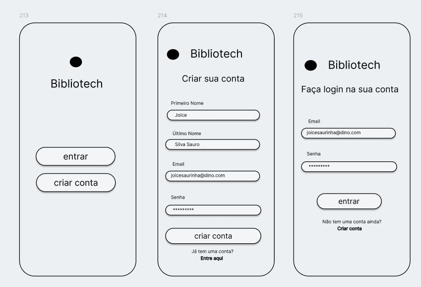

# Front-end Móvel

O projeto Bibliotech é uma plataforma de gestão de biblioteca pessoal que visa ajudar os usuários a organizar, catalogar e acompanhar suas leituras de forma eficiente. Através de uma interface intuitiva e amigável, os usuários podem registrar os livros que estão lendo, os livros que já leram e os livros que desejam ler no futuro. A plataforma também permite a criação de coleções personalizadas para catalogar seus livros em vários gêneros. 

Os objetivos do projeto Bibliotech incluem:

* Simplificar a organização e o controle das bibliotecas pessoais dos usuários.
* Oferecer uma interface intuitiva e de fácil uso para promover uma interação fluida dos usuários com a plataforma.
* Permitir que os usuários registrem os livros que estão lendo, já lidos e futuras leituras de maneira prática e organizada.
* Possibilitar a criação de coleções pessoais personalizadas que atendam aos interesses e preferências individuais de cada usuário.

## Tecnologias Utilizadas

As tecnologias utilizadas foram: React native, node.js, typescript 

## Arquitetura

Componentes React Native:

* Telas: Representam as diferentes interfaces do aplicativo, como tela de login, cadastro de livros, tela de coleções, etc.
* Componentes Reutilizados em várias partes do aplicativo: Componentes como botões, listas, formulários, barras de navegação, etc.

Serviços de API:

* Um serviço para realizar chamadas HTTP para o backend em Node.js, responsável pelas operações de CRUD (Create, Read, Update, Delete) relacionadas a usuários, livros, coleções e acervos pessoais. A interface do usuário irá rendezirar os componentes quando o mesmo fizer uma requisição utilizando um dos recursos do sistema, tendo os serviços de API chamados para atualizar os dados no backend e refletir a mudança dos dados na tela do usuário.

## Modelagem da Aplicação

Na presente aplicação temos como entidades principais:

- Usuário: Representa um usuário registrado na plataforma Bibliotech.
- Livro: Representa um livro dentro da biblioteca pessoal de um usuário.
- Acervo Pessoal: Representa uma coleção de livros organizada por um usuário.

## Projeto da Interface
O aplicativo móvel Bibliotech apresenta um design visual limpo e moderno, focado na usabilidade e na experiência do usuário. Utilizando uma paleta de cores suaves e agradáveis, o layout é organizado com espaçamento adequado entre elementos para facilitar a navegação e a compreensão das informações. Adaptável a diferentes tamanhos de tela, o design responsivo garante uma experiência consistente em dispositivos móveis, enquanto ícones intuitivos e tipografia legível complementam a interface, proporcionando uma interação eficiente e uma estética visualmente atraente.

Layout das Páginas:

Landing page:
* Exibe a logo da bibliotech e botões de acesso para entrar e criar conta

Página para login:
* Exibe um formulário para realizar login na plataforma.
* Inclui campos de email e senha.

Página para criação de usuário:
* Exibe um formulário para criar uma conta na plataforma.
* Inclui campos para inserir informações de nome, sobrenome, email e senha.

Página Inicial:
* Apresenta uma visão geral da biblioteca pessoal do usuário com 3 botões na parte inferior da página para rápido acesso aos modulos acervo, livros e coleções.
* Mostra os livros atualmente sendo lidos, os livros já lidos e os livros que o usuário deseja ler no futuro.
* Oferece acesso a funcionalidade de adicionar um novo livro.

Página de Adição de Livro:
* Exibe um formulário para adicionar um novo livro à biblioteca pessoal do usuário.
* Inclui campos para inserir informações como título, autor, editora, ano de publicação, ISBN, etc.

Página de Detalhes do Livro:
* Apresenta todos os dados do livro cadastrado.
* Oferece acesso a funcionalidade de editar um novo livro.

Página de Edição de Livro:
* Exibe um formulário para editar ou excluir o livro da biblioteca pessoal do usuário.
* Inclui campos para inserir informações como título, autor, editora, ano de publicação, ISBN, etc.

Página de Coleções:
* Apresenta a biblioteca pessoal do usuário, organizada em diferentes seções.

Página de Detalhes das Coleções:
* Apresenta os livros cadastrados da coleção selecionada.
* Permite ao usuário interagir com os livros, ver seus detalhes e editar os dados ou excluí-los caso desejável.

Página de Leituras:
* Apresenta a biblioteca pessoal do usuário, organizada em diferentes seções, como "Lendo Agora", "Lidos" e "Quero Ler".
* Cada livro é exibido com suas informações completas.
* Permite ao usuário interagir com os livros, ver seus detalhes e editar os dados caso desejável.

Página de Configurações do Usuário:
* Exibe um formulário para editar os dados como nome, sobrenome, email ou senha.

### Wireframes

### Design Visual

Paleta de Cores:
* A paleta de cores adota uma abordagem moderna e suave, com tons que evocam calma e sofisticação. As cores principais variam do lilás claro e suave (#f5f3ff) a um roxo mais profundo e vibrante (#2e1065).

Tipografia:
* A tipografia selecionada é a "Segoe UI", uma fonte moderna e legível que proporciona uma leitura confortável tanto em dispositivos móveis quanto em desktops. Essa fonte confere ao texto uma aparência limpa e clara.

Ícones:
* Os ícones na interface são simples e consistentes, adotando um estilo moderno e minimalista. Ícones vetoriais são utilizados para garantir escalabilidade e nitidez em diferentes tamanhos de tela.

Outros Elementos Gráficos:
* Além das cores, tipografia e ícones, outros elementos gráficos incluem:
* Botões: Botões com bordas arredondadas e efeitos de hover suaves para indicar interatividade.
* Barra de Navegação: Uma barra de navegação simples e intuitiva.
* Cards de Livros: Elementos gráficos que exibem informações sobre os livros na biblioteca do usuário, incluindo título, autor e status de leitura, entre outros detalhes.

### Layout Responsivo

Media Queries:
* Utilizaremos media queries para aplicar estilos específicos conforme o tamanho da tela do dispositivo. Essas consultas serão configuradas para ajustar o layout, o tamanho dos elementos e a disposição dos componentes conforme necessário, garantindo uma experiência de usuário otimizada.

Grid Layouts:
* Adotaremos sistemas de grid flexíveis para organizar eficientemente os elementos da página em diversos tamanhos de tela. Os layouts serão projetados para se adaptar intuitivamente, reorganizando os componentes conforme o espaço disponível na tela, mantendo a usabilidade e a legibilidade.

### Interações do Usuário

* Página de Adição de Livro:
O usuário acessa a página de adição de livro.
Para adicionar um novo livro, o usuário precisa entrar ou criar uma conta.
Após login ou cadastro, o usuário preenche um formulário com informações do livro, como título, autor e editora.
Ao enviar o formulário, o livro é adicionado à biblioteca pessoal do usuário.

* Página Inicial:
Na página inicial, o usuário vê sua biblioteca pessoal.
O usuário pode clicar em um livro para ver seus detalhes.
Para adicionar um novo livro, o usuário clica em um botão que redireciona para a página de adição de livro.

* Página de Detalhes do Livro:
Aqui, o usuário pode ver todas as informações do livro, como título, autor e editora.
O usuário pode clicar em um botão para editar essas informações, sendo redirecionado para a página de edição de livro.

* Página de Edição de Livro:
O usuário acessa esta página a partir da página de detalhes do livro.
A página apresenta um formulário preenchido com as informações atuais do livro.
O usuário faz as alterações desejadas e envia o formulário para salvar as mudanças.

* Página de Login:
O usuário acessa a página de login e preenche os campos de e-mail e senha.
Ao enviar o formulário, o usuário é autenticado e redirecionado para a página inicial.

* Página de Criação de Usuário:
O usuário acessa a página de criação de usuário e preenche suas informações pessoais, como nome, sobrenome, e-mail e senha.
Ao enviar o formulário, o usuário é cadastrado na plataforma e redirecionado para a página inicial.

* Página de Configurações do Usuário:
O usuário acessa esta página para atualizar suas informações pessoais, como nome, sobrenome, e-mail e senha.
Ao enviar o formulário, as alterações são salvas.

* Página de Coleções:
O usuário acessa a página de coleções e visualiza suas coleções pessoais e os livros contidos nelas.
Pode criar novas coleções e organizar seus livros conforme seus interesses e preferências.

* Página de Detalhes das Coleções:
O usuário acessa esta página clicando em uma coleção na página de coleções.
Aqui, visualiza os livros da coleção e suas informações.
O usuário pode interagir com os livros, ver detalhes e editar informações, assim como editar a própria coleção.

* Página de Leituras:
O usuário acessa a página de leituras e vê sua biblioteca pessoal organizada em seções como "Lendo Agora", "Lidos" e "Quero Ler".
O usuário pode interagir com os livros de forma semelhante à página inicial.

## Fluxo de Dados

Interação do Usuário com a Aplicação:
* O usuário utiliza a interface do Bibliotech para fornecer informações através de formulários, cliques em botões e outras ações de entrada.

Captura e Preparação de Dados:
* Os dados inseridos pelo usuário são coletados pela interface da aplicação e preparados para serem enviados ao servidor para processamento adicional.

Transmissão de Dados para o Servidor:
* Os dados coletados são enviados ao servidor da aplicação via requisições HTTP, utilizando métodos como POST ou PUT, dependendo da ação realizada pelo usuário (por exemplo, adicionar ou editar um livro).

Validação e Processamento no Servidor:
* No servidor, os dados recebidos são validados para garantir sua integridade e conformidade com as regras de negócio da aplicação. Após a validação, os dados são processados conforme necessário, executando operações como adicionar, atualizar ou excluir registros no banco de dados.

Interação com o Banco de Dados:
* Para armazenamento e recuperação de dados, o Bibliotech utiliza o MySQL. As operações de acesso ao banco de dados são realizadas através de consultas SQL.

Execução de Consultas e Comandos:
* As consultas e comandos SQL são executados para armazenar ou recuperar informações relacionadas aos livros, usuários e outras entidades da aplicação.

Retorno de Informações ao Cliente:
* Após o processamento no servidor e a manipulação dos dados no banco de dados, os resultados são retornados ao cliente via respostas HTTP. Essas respostas podem incluir dados atualizados, mensagens de confirmação, erros de validação ou outras informações relevantes para o usuário.

## Requisitos Funcionais

|ID    | Descrição do Requisito  | Prioridade |
|------|-----------------------------------------|----|
|RF-001| Permitir o cadastro de novo usuário no site| ALTA |
|RF-002| Processamento de login e logout no site | ALTA | 
|RF-003| Permitir o cadastro de um novo Acervo Pessoal  | ALTA |
|RF-004| Possibilitar que o usuário registre os livros que está lendo | ALTA |
|RF-005| Permitir a edição dos dados e status dos livros cadastrados | MÉDIA |
|RF-006| Permitir o usuário exportar sua coleção no acervo pessoal em arquivo csv | MÉDIA |
|RF-007| Permitir editar dados da conta de usuário | MÉDIA | 
|RF-008| Permitir o usuário editar os dados de um Acervo Pessoal| MÉDIA |
|RF-009| Permitir que o usuário acesse o sistema através de um dispositivo móvel | BAIXA |

## Requisitos Não Funcionais

|ID     | Descrição do Requisito  |Prioridade |
|-------|-------------------------|----|
|RNF-001| A interface deve ser intuitiva e fácil de usar, adequada para usuários com pouca familiaridade com tecnologia | ALTA | 
|RNF-002| Garantir a segurança dos dados pessoais e de leitura dos usuários | ALTA |
|RNF-003| O sistema deve ser responsivo para rodar em um dispositivos móvel | BAIXA |

## Considerações de Segurança

- Todos os endpoints são protegidos por autenticação via token, exceto o endpoint de criação de usuário.
- A comunicação é criptografada com HTTPS para proteger os dados em trânsito.
- As entradas de dados são validadas para prevenir ataques de injeção de código.

## Implantação

[Instruções para implantar a aplicação distribuída em um ambiente de produção.]

1. Defina os requisitos de hardware e software necessários para implantar a aplicação em um ambiente de produção.
2. Escolha uma plataforma de hospedagem adequada, como um provedor de nuvem ou um servidor dedicado.
3. Configure o ambiente de implantação, incluindo a instalação de dependências e configuração de variáveis de ambiente.
4. Faça o deploy da aplicação no ambiente escolhido, seguindo as instruções específicas da plataforma de hospedagem.
5. Realize testes para garantir que a aplicação esteja funcionando corretamente no ambiente de produção.

## Testes

| Caso de Teste ID   | Modulo   | Ação Específica do Teste  | Resultado Esperado | Resultado Atual |  
|-----------------|-----------------|-----------------|-----------------|-----------------|
| RF-001          | Cadastro de novo usuário    | Novo usuário é cadastrado com sucesso no site |  |
| RF-002          | Login no site               | Usuário consegue realizar o login com sucesso |  |
| RF-002          | Logout do site              | Usuário consegue realizar o logout com sucesso |  |
| RF-003          | Cadastro de novo Acervo Pessoal | Novo Acervo Pessoal é cadastrado com sucesso |  |
| RF-004          | Registro de livros sendo lidos | Usuário consegue registrar os livros que está lendo |  |
| RF-005          | Edição de dados e status dos livros | Usuário consegue editar os dados e status dos livros cadastrados |  |
| RF-006          | Edição de dados da conta de usuário | Usuário consegue editar os dados da sua conta de usuário |  |
| RF-007          | Edição de dados de um Acervo Pessoal | Usuário consegue editar os dados de um Acervo Pessoal |  |
| RF-008          | Acesso através de dispositivo móvel | Usuário consegue acessar o sistema através de um dispositivo móvel |  |
| RNF-001         | Interface intuitiva e fácil de usar | Usuários conseguem navegar facilmente pelo sistema, sem a necessidade de treinamento extensivo |  |
| RNF-002         | Garantia de segurança dos dados pessoais | Os dados pessoais e de leitura dos usuários são protegidos por medidas de segurança, como criptografia e controle de acesso |  |
| RNF-003         | Responsividade do sistema em dispositivos móveis | O sistema se adapta corretamente a diferentes tamanhos de tela e funcionalidades principais são acessíveis em dispositivos móveis |  |

# Referências
https://nodejs.org/docs/latest/api/, https://reactnative.dev/docs/getting-started, https://developer.android.com/studio?hl=pt-br
