# Front-end Web

### Introdução
   
  O projeto Bibliotech é uma plataforma de gestão de biblioteca pessoal projetada para ajudar os usuários a organizar, catalogar e acompanhar suas leituras de forma eficiente. Através de uma interface intuitiva e amigável, os usuários podem registrar os livros que estão lendo, os livros que já leram e os livros que desejam ler no futuro. Além disso, a plataforma permite a criação de coleções personalizadas, oferecendo uma experiência personalizada para cada usuário.

### Objetivos
   
Os principais objetivos do projeto Bibliotech são:

- Facilitar a organização e o gerenciamento da biblioteca pessoal dos usuários.
- Oferecer uma interface intuitiva e amigável para facilitar a interação dos usuários com a plataforma.
- Permitir que os usuários registrem os livros que estão lendo, já leram e desejam ler no futuro.
- Possibilitar a criação de coleções personalizadas de acordo com os interesses e preferências de cada usuário.

## Tecnologias Utilizadas
O projeto Bibliotech foi desenvolvido utilizando uma arquitetura de aplicativo web, com as seguintes tecnologias principais:

Frontend: Angular, tailwind e flowbite para a construção da interface do usuário.

## Arquitetura

- Interface do Usuário (UI):

Responsável pela apresentação dos elementos visuais da aplicação.
Inclui páginas, componentes de formulário, botões, barras de navegação, etc.

- Estado Global (Global State):

Gerenciado com Redux.
Armazena o estado global da aplicação, como informações do usuário, livros da biblioteca, etc.
Permite o compartilhamento de estado entre diferentes componentes.

- Serviços de API:

Módulos responsáveis por realizar chamadas à API do backend para recuperar ou enviar dados.
Abstrai a lógica de comunicação com o backend, como autenticação, manipulação de dados, etc.

- Interações:
A interface do usuário renderiza os componentes com base no estado global.
Quando o usuário interage com a interface (por exemplo, adicionando um livro à biblioteca), os serviços de API são chamados para atualizar os dados no backend.
As respostas da API são processadas e o estado global é atualizado, refletindo as alterações na interface do usuário.

## Modelagem da Aplicação
Na presente aplicação temos como entidades principais:

- Usuário: Representa um usuário registrado na plataforma Bibliotech.
- Livro: Representa um livro dentro da biblioteca pessoal de um usuário.
- Acervo Pessoal: Representa uma coleção de livros organizada por um usuário.

## Projeto da Interface Web

O design visual do Bibliotech é limpo, moderno e focado na usabilidade. Utiliza uma paleta de cores suaves e agradáveis ​​para criar uma experiência visual atraente para os usuários. Os elementos da interface são bem espaçados e organizados para facilitar a navegação e a compreensão das informações.

#### Layout das Páginas:

##### Landing page:

- Exibe a logo da bibliotech e botões de acesso 

##### Página de login:
  
- Exibe um formulário para realizar login na plataforma.

- Inclui campos para inserir informações como nome, sobrenome, email e senha.

##### Página de criação de usuário:

- Exibe um formulário para criar uma conta na plataforma.

- Inclui campos para inserir informações como nome, sobrenome, email e senha.

##### Página Inicial:
  
- Apresenta uma visão geral da biblioteca pessoal do usuário.

- Mostra os livros atualmente sendo lidos, os livros já lidos e os livros que o usuário deseja ler no futuro.

- Oferece acesso a funcionalidade de adicionar um novo livro.

##### Página de Adição de Livro:
  
- Exibe um formulário para adicionar um novo livro à biblioteca pessoal do usuário.

- Inclui campos para inserir informações como título, autor, editora, ano de publicação, capa do livro, etc.

##### Página de Detalhes do Livro:
  
- Apresenta todos os dados do livro cadastrado.

- Oferece acesso a funcionalidade de editar um novo livro.

##### Página de Edição de Livro:
  
- Exibe um formulário para editar um livro da biblioteca pessoal do usuário.

- Inclui campos para inserir informações como título, autor, editora, ano de publicação, capa do livro, etc.

##### Página de Coleções:
  
- Apresenta a biblioteca pessoal do usuário, organizada em diferentes seções.

##### Página de Detalhes das Coleções:
  
- Apresenta os livros cadastrados da coleção selecionada.

- Cada livro é exibido com sua capa, título, autor e outras informações relevantes.

- Permite ao usuário interagir com os livros, ver seus detalhes e editar os dados caso desejável.

##### Página de Leituras:
   
- Apresenta a biblioteca pessoal do usuário, organizada em diferentes seções, como "Lendo Agora", "Lidos" e "Quero Ler".

- Cada livro é exibido com sua capa, título, autor e outras informações relevantes.

- Permite ao usuário interagir com os livros, ver seus detalhes e editar os dados caso desejável.

##### Página de Configurações do Usuário:
  
- Exibe um formulário para editar os dados de uma conta na plataforma.

- Inclui campos para inserir informações como nome, sobrenome, email e senha.

### Wireframes

### Design Visual

##### Paleta de Cores:
A paleta de cores segue uma abordagem suave e moderna, com tons que transmitem uma sensação de calma e sofisticação. A paleta de cores inclui:

Primary:
Varia de tons de lilás e roxo, indo de um tom mais claro e suave (#f5f3ff) até um tom mais profundo e vibrante (#2e1065).

##### Tipografia:
A tipografia escolhida é a "Segoe UI", uma fonte moderna e legível, que oferece uma experiência de leitura confortável tanto em dispositivos móveis quanto em desktops. Ela transmite uma sensação de limpeza e clareza ao texto da interface.

##### Ícones:
Os ícones utilizados na interface são preferencialmente simplificados e consistentes, seguindo um estilo moderno e minimalista. Ícones vetoriais são preferidos para garantir escalabilidade e nitidez em diferentes tamanhos de tela.

##### Outros Elementos Gráficos:

Além das cores, tipografia e ícones, outros elementos gráficos podem incluir:

- Botões: Botões com bordas arredondadas e efeitos de hover suaves para indicar interatividade.
- Barra de Navegação: Uma barra de navegação simples e intuitiva.
- Cards de Livros: Elementos gráficos que exibem informações sobre os livros na biblioteca do usuário, com uma imagem da capa do livro, título, autor e outras informações como status de leitura, etc.
  
### Layout Responsivo

- Media Queries:
Serão utilizadas media queries para aplicar estilos específicos dependendo do tamanho da tela do dispositivo.
Essas media queries serão definidas para ajustar o layout, o tamanho dos elementos e a disposição dos componentes conforme necessário para proporcionar uma experiência de usuário otimizada.

- Grid Layouts:
Serão utilizados sistemas de grid flexíveis para organizar os elementos da página de forma eficiente em diferentes tamanhos de tela.
Os layouts serão projetados para se adaptar de maneira intuitiva, reorganizando os componentes conforme o espaço disponível na tela, mantendo a usabilidade e a legibilidade.

### Interações do Usuário

#### Página de Adição de Livro:
- O usuário acessa a página de adição de livro.
- Clica em entrar ou criar conta
- Será redirecionado para página escolhida

#### Página de Adição de Livro:
- O usuário acessa a página de adição de livro.
- Preenche o formulário com as informações do novo livro, como título, autor, editora, etc.
- Ao submeter o formulário, o livro é adicionado à biblioteca pessoal do usuário.

#### Página Inicial:
- Na página inicial, o usuário visualiza sua biblioteca pessoal.
- O usuário pode clicar em um livro para acessar os detalhes do mesmo.
- O usuário pode clicar em um botão para acessar a página de adição de livro e adicionar um novo livro à sua biblioteca.

### Página de Detalhes do Livro:

- Ao acessar os detalhes de um livro, o usuário pode ver todas as informações sobre o livro, como título, autor, editora, etc.

- O usuário pode clicar em um botão para editar as informações do livro e acessar a página de edição de livro.

#### Página de Edição de Livro:

- O usuário acessa a página de edição de livro clicando em um botão na página de detalhes do livro.

- A página exibe um formulário preenchido com as informações atuais do livro.

- O usuário pode fazer as alterações desejadas e submeter o formulário para salvar as mudanças.

#### Página de Login:

- O usuário acessa a página de login.

- Preenche os campos de e-mail e senha.

- Ao submeter o formulário, o usuário é autenticado e redirecionado para a página inicial da aplicação.

#### Página de Criação de Usuário:

- O usuário acessa a página de criação de usuário.

- Preenche os campos com suas informações pessoais, como nome, sobrenome, e-mail e senha.

- Ao submeter o formulário, o usuário é cadastrado na plataforma e redirecionado para a página inicial da aplicação.

#### Página de Configurações do Usuário:

- O usuário acessa a página de configurações do usuário.

- Preenche os campos com suas informações pessoais, como nome, sobrenome, e-mail e senha.

- Ao submeter o formulário, as alterações são salvas.

#### Página de Coleções:

- O usuário acessa a página de coleções.

- Visualiza suas coleções pessoais e os livros nelas contidos.

- Pode criar novas coleções e organizar seus livros de acordo com seus interesses e preferências específicos.

#### Página de Detalhes das Coleções:

- O usuário acessa a página de detalhes de uma coleção clicando em uma coleção na página de coleções.

- Visualiza os livros contidos na coleção e suas informações.

Permite ao usuário interagir com os livros, ver seus detalhes e editar os dados caso desejável, assim como também editar a coleção.

#### Página de Leituras:

- O usuário acessa a página de leituras.

- Visualiza sua biblioteca pessoal organizada em diferentes seções, como "Lendo Agora", "Lidos" e "Quero Ler".

- Interage com os livros da mesma forma que na página inicial
  
## Fluxo de Dados

#### Entrada de Dados do Usuário:

- O usuário interage com a interface da aplicação Bibliotech, fornecendo informações por meio de formulários, cliques em botões e outras ações de entrada.

#### Processamento de Dados na Interface:

- Os dados fornecidos pelo usuário são capturados pela interface da aplicação e preparados para serem enviados ao servidor para processamento adicional.

#### Envio de Dados para o Servidor:

- Os dados capturados pela interface são enviados para o servidor da aplicação por meio de requisições HTTP, utilizando métodos como POST ou PUT, dependendo da ação realizada pelo usuário (por exemplo, adicionar um novo livro, editar informações de um livro, etc.).
Validação e Processamento no Servidor:

- No servidor, os dados recebidos são validados para garantir sua integridade e conformidade com as regras de negócio da aplicação.
Após a validação, os dados são processados conforme necessário, executando operações como adicionar, atualizar ou excluir registros no banco de dados.

#### Acesso ao Banco de Dados:

- Para armazenamento e recuperação de dados, a aplicação Bibliotech utiliza MySQL. As operações de acesso ao banco de dados são realizadas por meio de consultas SQL.

#### Manipulação de Dados no Banco de Dados:

- As consultas e comandos enviados ao banco de dados são executados para armazenar ou recuperar informações relacionadas aos livros, usuários e outras entidades da aplicação.

#### Retorno de Dados ao Cliente:

- Após o processamento no servidor e a manipulação dos dados no banco de dados, os resultados são retornados ao cliente por meio de respostas HTTP.
- As respostas podem incluir dados atualizados, mensagens de confirmação, erros de validação ou outras informações relevantes para o usuário.

#### Atualização da Interface do Usuário:

Com base nas respostas recebidas do servidor, a interface do usuário é atualizada dinamicamente para refletir as alterações realizadas.

## Requisitos Funcionais

|ID    | Descrição do Requisito  | Prioridade |
|------|-----------------------------------------|----|
|RF-001| Permitir o cadastro de novo usuário no site| ALTA |
|RF-002| Processamento de login e logout no site | ALTA | 
|RF-003| Permitir o cadastro de um novo Acervo Pessoal  | ALTA |
|RF-004| Possibilitar que o usuário registre os livros que está lendo | ALTA |
|RF-005| Permitir a edição dos dados e status dos livros cadastrados | MÉDIA |
|RF-006| Permitir editar dados da conta de usuário | MÉDIA | 
|RF-007| Permitir o usuário editar os dados de um Acervo Pessoal| MÉDIA |
|RF-008| Permitir que o usuário acesse o sistema através de um dispositivo móvel | BAIXA |

## Requisitos Não Funcionais

|ID     | Descrição do Requisito  |Prioridade |
|-------|-------------------------|----|
|RNF-001| A interface deve ser intuitiva e fácil de usar, adequada para usuários com pouca familiaridade com tecnologia | ALTA | 
|RNF-002| Garantir a segurança dos dados pessoais e de leitura dos usuários | ALTA |
|RNF-003| O sistema deve ser responsivo para rodar em um dispositivos móvel | BAIXA |

## KPI's

| Indicador de Desempenho        | Descrição                                                  | Meta    |
|--------------------------------|------------------------------------------------------------|---------|
| Taxa de Sucesso na Adição      | Percentual de livros adicionados com sucesso em relação ao total de tentativas de adição. | 95%     |
| Tempo Médio de Adição           | Tempo médio necessário para adicionar um livro à biblioteca pessoal do usuário. | < 1 min |
| Taxa de Rejeição de Formulários | Percentual de formulários de adição de livro rejeitados devido a dados inválidos ou incompletos. | < 5%    |
| Eficiência do Processo         | Percentual de redução no tempo médio de adição de livro após a implementação de melhorias no processo. | 10%     |
| Satisfação do Usuário          | Avaliação média da satisfação dos usuários com o processo de adição de livro, em uma escala de 1 a 5. | > 4     |

## Fluxograma

### Landing Page

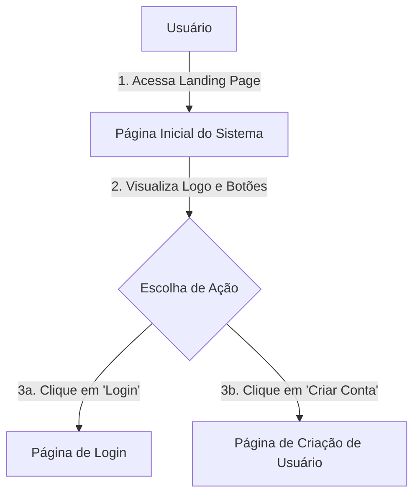

### Login

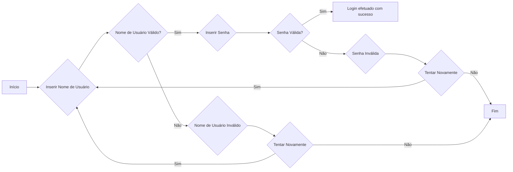

### Criação de Usuário 

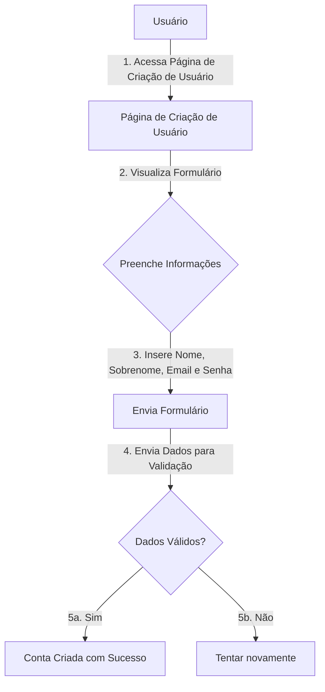

### Página Inicial

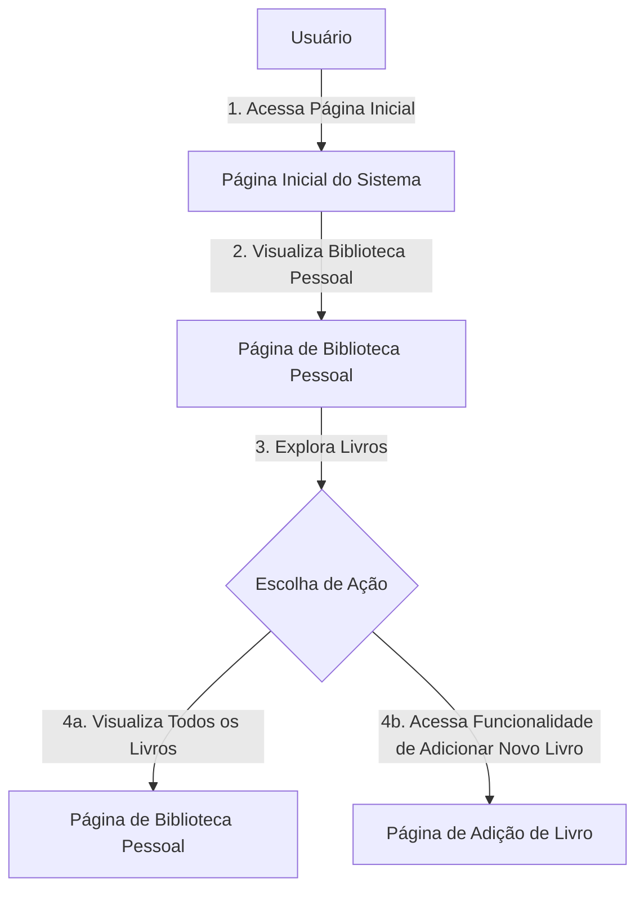

### Página de Adição de Livro

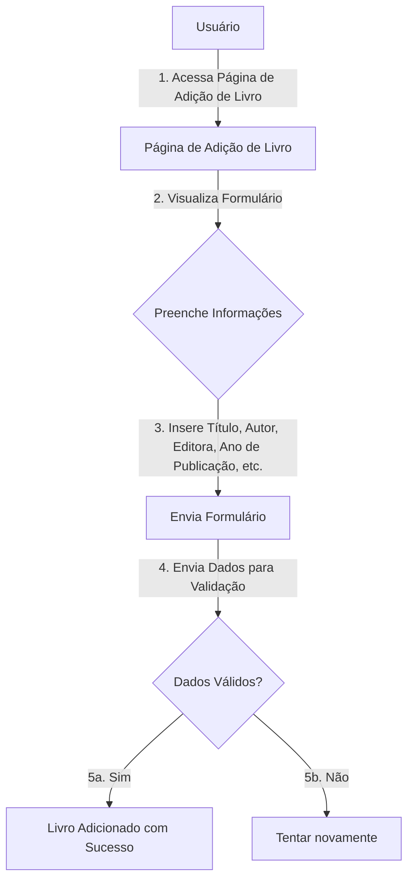

### Página de Detalhes do Livro

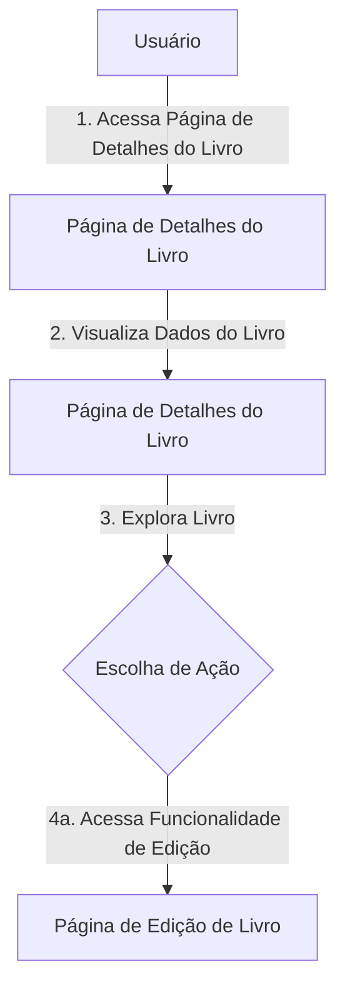

### Página de Edição do Livro

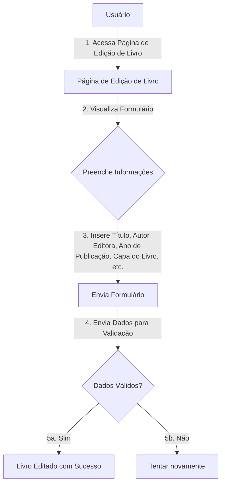

### Página de Coleções

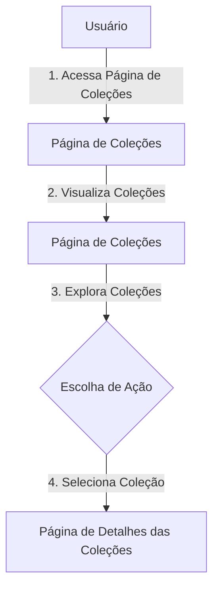

### Página de Detalhes da Coleção

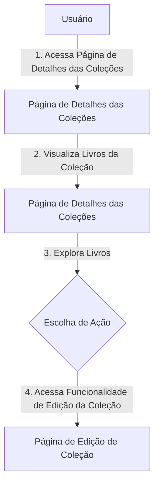

### Página de Leituras

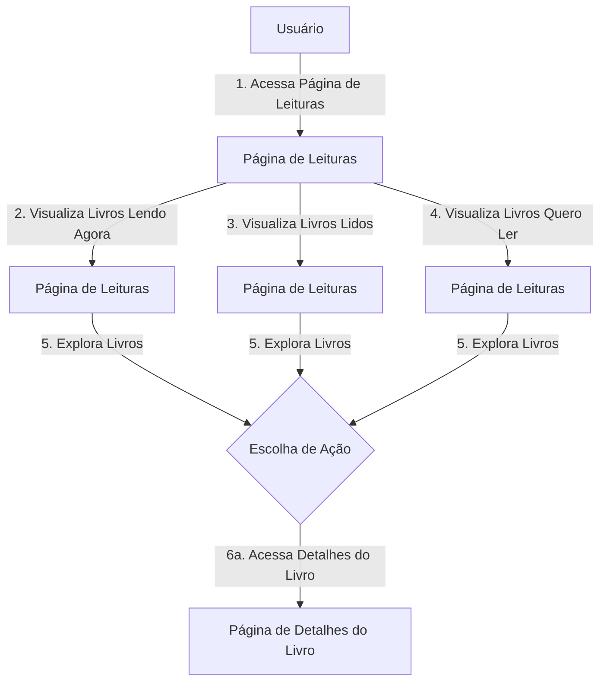

### Página de Configurações de Usuário

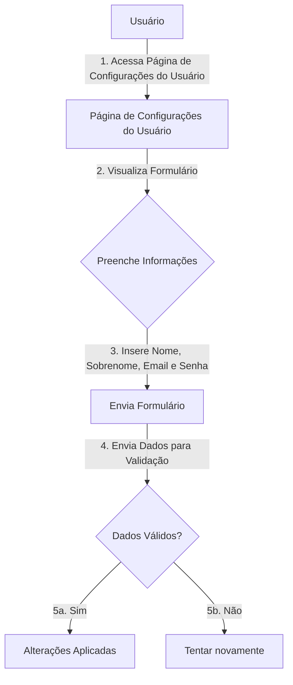

## Considerações de Segurança

- Todos os endpoints são protegidos por autenticação via token, exceto o endpoint de criação de usuário.
- A comunicação é criptografada com HTTPS para proteger os dados em trânsito.
- O acesso aos endpoints é limitado para evitar abusos e garantir uma utilização justa dos recursos do servidor.
- As entradas de dados são validadas para prevenir ataques de injeção de código.

## Implantação

[Instruções para implantar a aplicação distribuída em um ambiente de produção.]

1. Defina os requisitos de hardware e software necessários para implantar a aplicação em um ambiente de produção.
2. Escolha uma plataforma de hospedagem adequada, como um provedor de nuvem ou um servidor dedicado.
3. Configure o ambiente de implantação, incluindo a instalação de dependências e configuração de variáveis de ambiente.
4. Faça o deploy da aplicação no ambiente escolhido, seguindo as instruções específicas da plataforma de hospedagem.
5. Realize testes para garantir que a aplicação esteja funcionando corretamente no ambiente de produção.

## Testes

### Requisitos Funcionais

| ID do Requisito | Descrição do Caso de Teste | Resultado Esperado | Resultado Obtido |
|-----------------|-----------------------------|--------------------|------------------|
| RF-001          | Cadastro de novo usuário    | Novo usuário é cadastrado com sucesso no site |  |
| RF-002          | Login no site               | Usuário consegue realizar o login com sucesso |  |
| RF-002          | Logout do site              | Usuário consegue realizar o logout com sucesso |  |
| RF-003          | Cadastro de novo Acervo Pessoal | Novo Acervo Pessoal é cadastrado com sucesso |  |
| RF-004          | Registro de livros sendo lidos | Usuário consegue registrar os livros que está lendo |  |
| RF-005          | Edição de dados e status dos livros | Usuário consegue editar os dados e status dos livros cadastrados |  |
| RF-006          | Edição de dados da conta de usuário | Usuário consegue editar os dados da sua conta de usuário |  |
| RF-007          | Edição de dados de um Acervo Pessoal | Usuário consegue editar os dados de um Acervo Pessoal |  |
| RF-008          | Acesso através de dispositivo móvel | Usuário consegue acessar o sistema através de um dispositivo móvel |  |

### Requisitos não funcionais

| ID do Requisito | Descrição do Caso de Teste | Resultado Esperado | Resultado Obtido |
|-----------------|-----------------------------|--------------------|------------------|
| RNF-001         | Interface intuitiva e fácil de usar | Usuários conseguem navegar facilmente pelo sistema, sem a necessidade de treinamento extensivo |  |
| RNF-002         | Garantia de segurança dos dados pessoais | Os dados pessoais e de leitura dos usuários são protegidos por medidas de segurança, como criptografia e controle de acesso |  |
| RNF-003         | Responsividade do sistema em dispositivos móveis | O sistema se adapta corretamente a diferentes tamanhos de tela e funcionalidades principais são acessíveis em dispositivos móveis |  |

# Referências

https://angular.io/docs, https://tailwindcss.com, https://flowbite.com/docs/getting-started/introduction/
