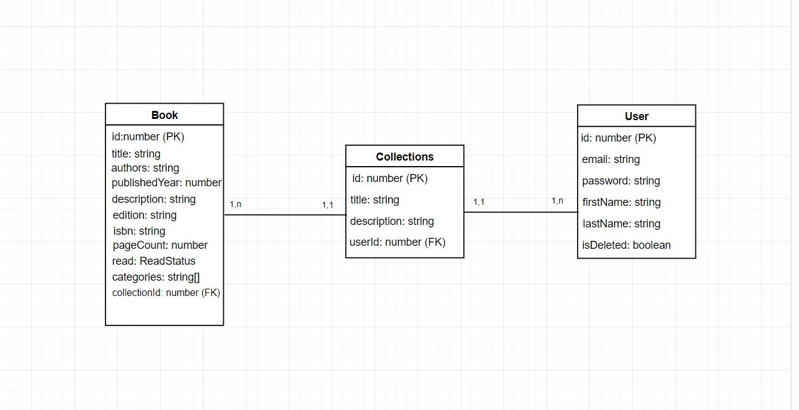

# Front-end Web

### Introdução
   
  O projeto Bibliotech é uma plataforma de gestão de biblioteca pessoal projetada para ajudar os usuários a organizar, catalogar e acompanhar suas leituras de forma eficiente. Através de uma interface intuitiva e amigável, os usuários podem registrar os livros que estão lendo, os livros que já leram e os livros que desejam ler no futuro. Além disso, a plataforma permite a criação de coleções personalizadas, oferecendo uma experiência personalizada para cada usuário.

### Objetivos
   
Os principais objetivos do projeto Bibliotech são:

- Facilitar a organização e o gerenciamento da biblioteca pessoal dos usuários.
- Oferecer uma interface intuitiva e amigável para facilitar a interação dos usuários com a plataforma.
- Permitir que os usuários registrem os livros que estão lendo, já leram e desejam ler no futuro.
- Possibilitar a criação de coleções personalizadas de acordo com os interesses e preferências de cada usuário.

## Tecnologias Utilizadas
O projeto Bibliotech foi desenvolvido utilizando uma arquitetura de aplicativo web, com as seguintes tecnologias principais:

Frontend: Angular, tailwind e flowbite para a construção da interface do usuário.

## Arquitetura

- Interface do Usuário (UI):

Responsável pela apresentação dos elementos visuais da aplicação.
Inclui páginas, componentes de formulário, botões, barras de navegação, etc.

- Estado Global (Global State):

Gerenciado com Redux.
Armazena o estado global da aplicação, como informações do usuário, livros da biblioteca, etc.
Permite o compartilhamento de estado entre diferentes componentes.

- Serviços de API:

Módulos responsáveis por realizar chamadas à API do backend para recuperar ou enviar dados.
Abstrai a lógica de comunicação com o backend, como autenticação, manipulação de dados, etc.

- Interações:
A interface do usuário renderiza os componentes com base no estado global.
Quando o usuário interage com a interface (por exemplo, adicionando um livro à biblioteca), os serviços de API são chamados para atualizar os dados no backend.
As respostas da API são processadas e o estado global é atualizado, refletindo as alterações na interface do usuário.

## Modelagem da Aplicação
Na presente aplicação temos como entidades principais:

Usuário: Representa um usuário registrado na plataforma Bibliotech.
Livro: Representa um livro dentro da biblioteca pessoal de um usuário.
Acervo Pessoal: Representa uma coleção de livros organizada por um usuário.

## Projeto da Interface Web

O design visual do Bibliotech é limpo, moderno e focado na usabilidade. Utiliza uma paleta de cores suaves e agradáveis ​​para criar uma experiência visual atraente para os usuários. Os elementos da interface são bem espaçados e organizados para facilitar a navegação e a compreensão das informações.

#### Layout das Páginas:

1. Landing page:
Exibe a logo da bibliotech e botões de acesso

2. Página de login:
Exibe um formulário para realizar login na plataforma.
Inclui campos para inserir informações como nome, sobrenome, email e senha.

3. Página de criação de usuário:

Exibe um formulário para criar uma conta na plataforma.
Inclui campos para inserir informações como nome, sobrenome, email e senha.

4. Página Inicial:
Apresenta uma visão geral da biblioteca pessoal do usuário.
Mostra os livros atualmente sendo lidos, os livros já lidos e os livros que o usuário deseja ler no futuro.

Oferece acesso a funcionalidade de adicionar um novo livro.

5. Página de Adição de Livro:
Exibe um formulário para adicionar um novo livro à biblioteca pessoal do usuário.
Inclui campos para inserir informações como título, autor, editora, ano de publicação, capa do livro, etc.

6. Página de Detalhes do Livro:
Apresenta todos os dados do livro cadastrado.

Oferece acesso a funcionalidade de editar um novo livro.

7. Página de Edição de Livro:
Exibe um formulário para editar um livro da biblioteca pessoal do usuário.
Inclui campos para inserir informações como título, autor, editora, ano de publicação, capa do livro, etc.

8. Página de Coleções:
Apresenta a biblioteca pessoal do usuário, organizada em diferentes seções.

9. Página de Detalhes das Coleções:
Apresenta os livros cadastrados da coleção selecionada.

Cada livro é exibido com sua capa, título, autor e outras informações relevantes.
Permite ao usuário interagir com os livros, ver seus detalhes e editar os dados caso desejável.

10. Página de Leituras:
   
Apresenta a biblioteca pessoal do usuário, organizada em diferentes seções, como "Lendo Agora", "Lidos" e "Quero Ler".
Cada livro é exibido com sua capa, título, autor e outras informações relevantes.
Permite ao usuário interagir com os livros, ver seus detalhes e editar os dados caso desejável.

11. Página de Configurações do Usuário:
Exibe um formulário para editar os dados de uma conta na plataforma.
Inclui campos para inserir informações como nome, sobrenome, email e senha.

#### Interações do Usuário:

1. Adição de Livro:
O usuário pode adicionar um novo livro à sua biblioteca pessoal preenchendo um formulário com as informações do livro.

2. Organização da Biblioteca:
O usuário pode organizar sua biblioteca pessoal movendo livros entre diferentes seções para organizar seus livros de acordo com interesses e preferências específicos.

3. Acompanhamento de Leituras:
O usuário pode marcar os livros que está atualmente lendo, atualizando o progresso de leitura, como "Lendo Agora", "Lidos" e "Quero Ler". 

### Wireframes
[Inclua os wireframes das páginas principais da interface, mostrando a disposição dos elementos na página.]

### Design Visual
[Descreva o estilo visual da interface, incluindo paleta de cores, tipografia, ícones e outros elementos gráficos.]

### Layout Responsivo
[Discuta como a interface será adaptada para diferentes tamanhos de tela e dispositivos.]

### Interações do Usuário
[Descreva as interações do usuário na interface, como animações, transições entre páginas e outras interações.]

## Fluxo de Dados

[Diagrama ou descrição do fluxo de dados na aplicação.]

## Requisitos Funcionais

[Liste os principais requisitos funcionais da aplicação.]

## Requisitos Não Funcionais

[Liste os principais requisitos não funcionais da aplicação, como desempenho, segurança, escalabilidade, etc.]

## Considerações de Segurança

[Discuta as considerações de segurança relevantes para a aplicação distribuída, como autenticação, autorização, proteção contra ataques, etc.]

## Implantação

[Instruções para implantar a aplicação distribuída em um ambiente de produção.]

1. Defina os requisitos de hardware e software necessários para implantar a aplicação em um ambiente de produção.
2. Escolha uma plataforma de hospedagem adequada, como um provedor de nuvem ou um servidor dedicado.
3. Configure o ambiente de implantação, incluindo a instalação de dependências e configuração de variáveis de ambiente.
4. Faça o deploy da aplicação no ambiente escolhido, seguindo as instruções específicas da plataforma de hospedagem.
5. Realize testes para garantir que a aplicação esteja funcionando corretamente no ambiente de produção.

## Testes

[Descreva a estratégia de teste, incluindo os tipos de teste a serem realizados (unitários, integração, carga, etc.) e as ferramentas a serem utilizadas.]

1. Crie casos de teste para cobrir todos os requisitos funcionais e não funcionais da aplicação.
2. Implemente testes unitários para testar unidades individuais de código, como funções e classes.
3. Realize testes de integração para verificar a interação correta entre os componentes da aplicação.
4. Execute testes de carga para avaliar o desempenho da aplicação sob carga significativa.
5. Utilize ferramentas de teste adequadas, como frameworks de teste e ferramentas de automação de teste, para agilizar o processo de teste.

# Referências

Inclua todas as referências (livros, artigos, sites, etc) utilizados no desenvolvimento do trabalho.
